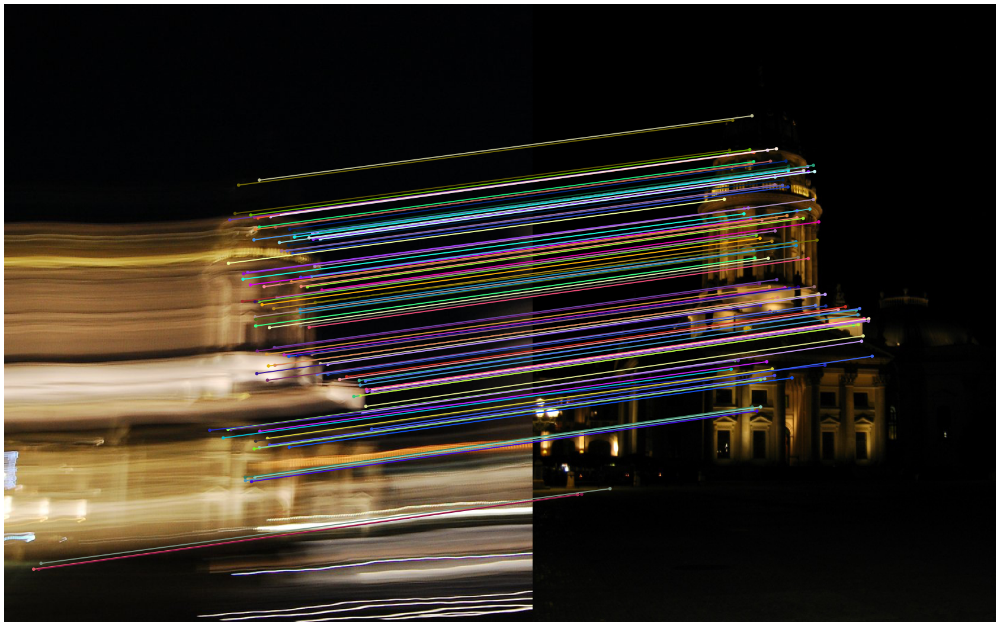

# A Toolbox for Image Feature Matching and Evaluations 
In this repository, we provide **easy interfaces** for several exisiting SotA methods to match image feature correspondences between image pairs.
We provide **scripts to evaluate** their predicted correspondences on common benchmarks for the tasks of image matching, homography estimation and visual localization.

### Notice
- This repository is expected to be actively maintained  (at least before I graduate🤣🤣)  and **gradually** (slowly) grow for new features of interest.
- Suggestions regarding how to improve this repo, such as adding new **SotA** image matching methods or new benchmark evaluations, are welcome 👏.

### Regarding Patch2Pix
With this reprository, one can **reproduce** the tables reported in our  paper accepted at CVPR2021: Patch2Pix: Epipolar-Guided Pixel-Level Correspondences[[pdf]](https://arxiv.org/abs/2012.01909).  Check [our patch2pix repository](https://github.com/GrumpyZhou/patch2pix) for its training code.

###  Disclaimer 
-  All of the supported methods and evaluations are **not implemented from scratch**  by us.  Instead, we modularize their original code to define unified interfaces.
- If you are using the results of a method, **remember to cite the corresponding paper**.
- All credits of the implemetation of those methods belong to their authors .

## Supported Methods & Evaluations 
**Keypoint-based Matching:**
 - Local Feature:
[CAPS](https://arxiv.org/abs/2004.13324), [D2Net](https://arxiv.org/abs/1905.03561),  [R2D2](https://arxiv.org/abs/1906.06195), [SuperPoint](https://arxiv.org/abs/1712.07629)
 - Matcher: [SuperGlue](https://arxiv.org/abs/1911.11763)

**Keypoint/Detection-free Matching:**

 - Correspondence Network:  [NCNet](https://arxiv.org/abs/1810.10510),  [SparseNCNet](https://arxiv.org/pdf/2004.10566.pdf),
 -  Detection free: [LoFTR](https://zju3dv.github.io/loftr/)
- Local Refinement: [Patch2Pix](https://arxiv.org/abs/2012.01909)

**Supported Evaluations** :
- Image feature matching on HPatches
- Homography estimation on HPatches
- Visual localization benchmarks: 
	- InLoc
	- Aachen (original + v1.1)

## Repository Overview
The repository is structured as follows:
 - **configs/**: Each method has its own yaml (.yml) file to configure its testing parameters. 
 - **data/**: All datasets should be placed under this folder following our instructions described in **Data Preparation**.
 - **immatch/**: It contains implementations of method wrappers  and evaluation interfaces.
 - **outputs/**: All evaluation results are supposed to be saved here. One folder per benchmark.
 - **pretrained/**: It contains the pretrained models of the supported methods. 
 - **third_party/**: The real implementation of the supported methods from their original repositories, as git submodules.
 - **notebooks/**: It contains jupyter notebooks that show example codes to quickly access the methods implemented in this repo. 
 - **docs/**: It contains separate documentation  about installation and evaluation. To keep a clean face of this repo :).

#### 👉Refer to [install.md](docs/install.md) for details about installation.
#### 👉Refer to [evaluation.md](docs/evaluation.md) for details about evaluation on benchmarks.

## Example Code for Quick Testing
To use a specific method to perform the matching task, you simply need to do:
-  **Initialize a matcher using its config file.**  See examples of config yaml files under [configs](configs/) folder, eg., [patch2pix.yml](configs/patch2pix.yml).  Each config file contains multiple sections, each section corresponds to one setting. Here, we use the setting (*tagged by 'example'*) for testing on example image pairs.
- **Perform matching**
```python
import immatch
import yaml
from immatch.utils import plot_matches

# Initialize model
with open('configs/patch2pix.yml, 'r') as f:
    args = yaml.load(f, Loader=yaml.FullLoader)['example']
model = immatch.__dict__[args['class']](args)
matcher = lambda im1, im2: model.match_pairs(im1, im2)

# Specify the image pair
im1 = 'third_party/patch2pix/examples/images/pair_2/1.jpg'
im2 = 'third_party/patch2pix/examples/images/pair_2/2.jpg'

# Match and visualize
matches, _, _, _ = matcher(im1, im2)    
plot_matches(im1, im2, matches, radius=2, lines=True)
```


#### 👉 Try out the code using [example notebook ](notebooks/visualize_matches_on_example_pairs.ipynb).


## TODOs & Updates
```
- [x] Add LoFTR method (2021-7-8)
- [x] Add simple match visualization (2021-7-8)
- [ ] Localize on RobotCar 
```
